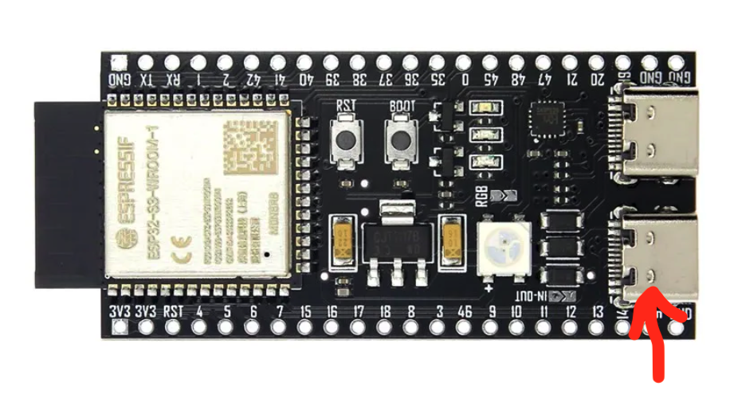

# MQTT host server for sensor nodes
> [!CAUTION]
> This is private project, working under the specific environment.


## :rocket: Mysql Install
##### Install
```
brew install mysql
brew services start mysql
mysql_secure_installation
brew services restart mysql

Enter password for user root: thermal1215@R
Disallow root login remotely? [Y/n] n
Reload privilege tables now? [Y/n] y
```
##### 테이블 자동 생성 스크립트
```
> mysql -u root -p < mysql_batch.sql > mysql_batch.log
Enter password:🔑thermal1215@R
```
> [!NOTE]
> * 'dust_data' 테이블에 추가 컬럼(RAW DATA 관련) 있습니다.
> * [mysql_batch.sql](./mysql_batch.sql) 파일 참조 하셔서 테이블 생성 하세요.
> * [config/config_mysql.js](config/config_mysql.js) 접속 계정에 맞게 테이블 접근 권한 설정 해주세요.

## :rocket: Install Mosquitto MQTT broker
#####  Install
```
> brew install mosquitto

//현재폴더에 passwd.secret 파일명으로 유저 mqtt_user , 패스워드 pass1234 설정파일 생성
> mosquitto_passwd -c passwd.secret mqtt_user
  enter password : pass1234
  Re-enter password : pass1234

> brew services stop mosquitto
> killall mosquitto
> code $HOMEBREW_PREFIX/etc/mosquitto/mosquitto.conf
```
mosquitto.conf 파일 열어서 아래 내용 추가
```
allow_anonymous true
listener 1883
password_file /Users/$USER/...../kmong-sensor-host/passwd.secret
```
- 패스워드 파일 경로(/Users/$USER/.....)는 위에서 생성한 passwd.secret 파일의 경로로 수정)
- allow_anonymous true|false, 유저 아이디/패스워드 사용 유무


##### Mosquitto 실행관련 명령어
```
brew services start mosquitto
brew services stop mosquitto
brew services restart mosquitto
```
#####  Pub/Sub 예시
```
MQTT_HOST=192.168.0.101
MQTT_PORT=1883
SUB_TOPIC=data/sensor
PUB_TOPIC=cmd/actuator
MQTT_USER=mqtt_user
MQTT_PASSWORD=pass1234
mosquitto_sub -h $MQTT_HOST -p $MQTT_PORT -t $SUB_TOPIC -u $MQTT_USER -P $MQTT_PASSWORD
mosquitto_pub -h $MQTT_HOST -p $MQTT_PORT -t $PUB_TOPIC -u $MQTT_USER -P $MQTT_PASSWORD -m "MSG PAYLOAD" 
```

## :rocket: 서버 다운로드 및 실행

#### 1. 서버 방화벽 설정


#### 2. Git clone
```
git clone https://github.com/sam0910/kmong-sensor-host
cd kmong-sensor-host
npm install
```

#### 3. 설정파일 수정
```
기기 설정파일  : src/config.json
MQTT 설정파일 : config/config_mqtt.js
MYSQL설정파일 : config/config_mysql.js
```
> - [src/config.json](src/config.json) 파일은 기기 설정 파일로 전원 ON시 자동으로 기기로 다운로드 됩니다.
> - http://$SERVER_IP:8080/src/config.json 로 접근 가능 합니다.

#### 4. 서버 실행
```
npm run mysql (mysql 및 mqtt 재시작)
npm start
```


## :rocket: Actuator Control
> [!NOTE]
> * 지정한 방향(direction)으로 지정한 시간(duration-밀리초)동안 작동하고 정지
> * 속도는 5mm/s @ 100Hz (제조사 스펙상 최대 속도 6mm/s)
> * direction=stop(정지명령) 일때 duration, limit 값은 무시 또는 미지정 가능.
> * forward(전진), backward(후진) 명령시 duration, limit 값 필수 지정


> [!WARNING]
> * 30초 사용후 -> 5분간 정지
> * 1분  사용후 -> 9분간 정지
> * 2분  사용후 -> 18분간 정지 (2분 초과시 모터 파손 가능성 있음)

```
direction : forward|backward|stop, default: stop
duration  : miliseconds, default: 0
limit     : nc|no, default: nc
       nc : 리밋스위치 NC 일때 정지
       no : 리밋스위치 NO 일때 정지
```
######  HTTP로 명령 전송시
```
URL: http://$SERVER_IP:8080/actuator
GET: direction=forward&duration=1200&limit=nc
예시: http://$SERVER_IP:8080/actuator?direction=forward&duration=1200&limit=nc
```
######  MQTT로 명령 전송시
```
TOPIC  : cmd/actuator
PAYLOAD: direction=forward&duration=1200&limit=nc
```

## :rocket: Fan Control
> [!NOTE]
> * power=on 일때 speed 값 필수 지정
> * power=off 일때 speed 값은 무시 또는 미지정 가능.
```
power: on|off, default: off
speed: 1|2|3|4|5, default: 0
```
#####  HTTP로 명령 전송시
```
URL: http://$SERVER_IP:8080/fan
GET: power=on&speed=2
예시: http://$SERVER_IP:8080/fan?power=on&speed=2
```
#####  MQTT로 명령 전송시
```
TOPIC: cmd/fan
PAYLOAD: power=on&speed=2
```

## :rocket: 센서값 단위
> [!NOTE]
> - 온도 : ℃
> - 습도 : %
> - 이산화탄소 : ppm
> - 대기압 : Pa
#### dust_data 테이블 추가 컬럼 설명
```
measured_dust 컬럼에 공기질지표 AQI 값이 저장됩니다.
Dictionary Key별 측정 데이터는 아래와 같습니다.

Key          | Description |                                               
:------------|:------------------------------------------------------------
measured_dust| Air Quality Index (좋음,나쁨 등)
PM1_0        | PM 1.0(1마이크로미터 입자) 농도 마이크로그램(μg)/m3 (공장세팅환경)           
PM2_5        | PM 2.5(2.5마이크로미터 입자) 농도 마이크로그램(μg)/m3 (공장세팅)             
PM10_0       | PM 10(10마이크로미터 입자) 농도 마이크로그램(μg)/m3 (공장세팅환경)            
PM1_0_ATM    | PM 1.0(1마이크로미터 입자) 농도 마이크로그램(μg)/m3 (일반대기 환경)       
PM2_5_ATM    | PM 2.5(2.5마이크로미터 입자) 농도 마이크로그램(μg)/m3 (일반대기 환경)       
PM10_0_ATM   | PM 10(10마이크로미터 입자) 농도 마이크로그램(μg)/m3 (일반대기 환경)        
PCNT_0_3     | 직경 0.3 마이크로 미터(μm) 이상 입자수, 0.1 리터 공기 당
PCNT_0_5     | 직경 0.5 마이크로 미터(μm) 이상 입자수, 0.1 리터 공기 당
PCNT_1_0     | 직경 1.0 마이크로 미터(μm) 이상 입자수, 0.1 리터 공기 당
PCNT_2_5     | 직경 2.5 마이크로 미터(μm) 이상 입자수, 0.1 리터 공기 당
PCNT_5_0     | 직경 5.0 마이크로 미터(μm) 이상 입자수, 0.1 리터 공기 당
PCNT_10_0    | 직경 10.0 마이크로 미터(μm) 이상 입자수, 0.1 리터 공기 당
```
공기질지표(Air Quality Index) 관련 자료는 [위키피디아 참조](https://en.wikipedia.org/wiki/Air_quality_index#Computing_the_AQI)
## :rocket: 기기로 다운로드 되는 설정파일(config.json)
```
{
    // 센서값 업데이트 주기 (초)
    "update_interval": {
        "dust": 60,
        "co2": 60,
        "barometer": 60,
        "temperature": 60,
        "humidity": 60
    },
    // 기기연결정보
    "connection": {
        "mqtt_host": "192.168.0.101",
        "mqtt_port": 1883,
        "mqtt_id": "mqtt_user",
        "mqtt_password": "pass1234",
        "wifi_ssid": "thermal-AP",
        "wifi_password": "thermal1215",
        "config_file": "http://$SERVER_IP:8080/src/config.json"
    },
    // 팬 스피드 설정 (Hz)
    "fan": {
        "speed_1_freq": 1000,
        "speed_2_freq": 5000,
        "speed_3_freq": 10000,
        "speed_4_freq": 15000,
        "speed_5_freq": 20000
    },
    // 액추에이터 모터 회전속도 설정 (Hz)
    "actuator": {
        "max_freq": 100
    },
    "version": "0.9.0",
    "version_note": "LOCALSERVER"
}
```
## 디바이스(센서보드, 액츄에이터보드) 설정 방법
> [!NOTE]
> 
> * 디바이스는 전원ON시 지정된 설정파일(config.json)을 기기로 다운로드 합니다.
> * <ins>커넥션에러(WiFi,MQTT)</ins> 또는 <ins>설정파일 다운로드 에러</ins>시에 디바이스는 자동으로 설정모드(AP)로 진입합니다.
> * 서버의 WiFi 리스트에 설정이 필요한 디바이스가 표시되며, 해당 WiFi로 연결시 자동으로 설정창이 나옵니다.
> * 설정 완료 후 Board Restart를 눌러 디바이스를 재시작하면 새로운 WiFi 및 설정파일이 적용 됩니다.

> [!TIP]
> 
> * 디바이스 설정시 열려있는 브라우져(사파리,크롬) 닫고 진행 하시면 좋습니다.
> * 설정창이 뜨지 않거나 닫힐경우, 다른 Wifi 접속후에 다시 해당 디바이스AP로 접속하시면 정상 작동 됩니다.
> * 스마트폰 에서도 설정 가능합니다.(스마트폰 와이파이 리스트에서 해당 디바이스 선택)


## 디바이스 파일 업로드

> [!NOTE]
> Python 3 설치되어 있어야 합니다.

#### 아래 그림의 붉은 화살표 위치에 USB 연결(UART)


```
cd ./upload
chmod +x ./upload.sh
bash ./upload.sh


🚀 Port number or ENTER : 
# 포트번호(숫자만) 또는 엔터키(/dev/cu.usbserial-110) 입력

🚀 Upload file name ? (constants.py): 엔터 입력


#########################
# VERSION : 2024-01-02  #
#########################
위의 글자 보이면 업로드 완료
```


